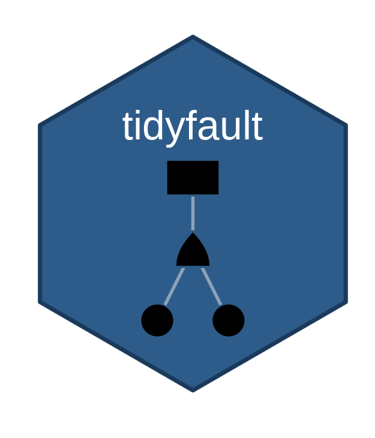

<!-- README.md is generated from README.Rmd. Please edit README.Rmd. -->

```{r setup, include = FALSE}
knitr::opts_chunk$set(
  collapse = TRUE,
  comment = "#>",
  fig.path = "man/figures/README-",
  out.width = "100%",
  message = FALSE,
  warning = FALSE
)
# When knitting from the package source tree, load in-development code so
# README matches the current repository (not necessarily the installed build).
if (requireNamespace("pkgload", quietly = TRUE) && file.exists("R/plot.R")) {
  pkgload::load_all(quiet = TRUE)
}
```

# tidyfault



## R Package for tidy *Fault Tree Analysis* (FTA)!

**`tidyfault`** uses `tidyverse`, `tidygraph`, and related tools to visualize fault trees, identify minimal cutsets, and evaluate failure outcomes.

Fault tree methods are used in aerospace, energy, safety, and security contexts. The package keeps trees in rectangular **nodes** and **edges** tables so you can combine FTA with familiar data manipulation and plotting tools in R.

---

## Applications

<div class="tf-mood-grid">


  <details><summary>Image Sources</summary>
  All photographs are served from the [Unsplash](https://unsplash.com/) CDN and are subject to the [Unsplash License](https://unsplash.com/license).
  </details>

</div>

---

## Key capabilities

| Capability | What tidyfault provides |
|------------|-------------------------|
| Tidy inputs | Fault trees as [`nodes` / `edges`](https://tidyfault.netlify.app/reference/curate.html) tables (one row per gate or basic event, one row per directed link). |
| Core pipeline | [`curate()`](https://tidyfault.netlify.app/reference/curate.html) → [`equate()`](https://tidyfault.netlify.app/reference/equate.html) → [`formulate()`](https://tidyfault.netlify.app/reference/formulate.html) → [`calculate()`](https://tidyfault.netlify.app/reference/calculate.html) → [`concentrate()`](https://tidyfault.netlify.app/reference/concentrate.html) → [`tabulate()`](https://tidyfault.netlify.app/reference/tabulate.html). |
| Minimal cutsets | MOCUS-style expansion ([`mocus()`](https://tidyfault.netlify.app/reference/mocus.html), Rcpp-backed by default) plus boolean reduction in [`concentrate()`](https://tidyfault.netlify.app/reference/concentrate.html). |
| Visualization | [`illustrate()`](https://tidyfault.netlify.app/reference/illustrate.html) and [`plot()`](https://tidyfault.netlify.app/reference/plot.html) for **ggplot2** / **ggraph** fault tree layouts. |
| Quantification | [`quantify()`](https://tidyfault.netlify.app/reference/quantify.html) for binary scenarios or top-event probabilities over many rows at once. |
| Documentation | [Articles](https://tidyfault.netlify.app/articles/index.html) on workflows, plotting, `quantify()`, and simulation. |


---

## Basic Usage

How do we use `tidyfault` to analyze fault trees?

### Load Packages and Data

Let's start by loading our dependencies!

```{r load}
# Load dependencies
library(tidyfault)
library(tidyverse)
```

Next, let's get some fake data to work with, including **nodes** and **edges** in our fault tree.

```{r data}
#Load example data into our environment
data("fakenodes")
data("fakeedges")
```

### Workflow (Step-by-Step)

Finally, let's demonstrate the basic workflow for `tidyfault`!

First, we...

1. `curate()` a list of **gates** in the fault tree;

```{r curate}
mygates = curate(nodes = fakenodes, edges = fakeedges)
mygates
```

2. use `equate()` to find the boolean equation for the fault tree;

```{r equate}
myequation = mygates %>% equate()
myequation
```

3. `formulate()` that equation into an `R` function we can use;

```{r formulate}
myfunction = myequation %>% formulate()
myfunction
```

4. `calculate()` the full truth table of all possible combinations of events and the `outcome` each leads to.

```{r calculate}
mycombos = myfunction %>% calculate()
head(mycombos)
```

5. `concentrate()` our gate structure into the minimum cutsets, the smallest sets of events necessary to cause system failure. This function uses boolean minimalization to find the minimum cutsets.

```{r concentrate}
mymin = mygates %>% concentrate()
mymin
```

6. `tabulate()` the minimum cutsets and how much coverage they have over the total paths to failure found with `calculate()`. `tabulate()` needs both the minimum cutsets and the formula (function from step 3).

```{r tabulate}
mytable = tabulate(mymin, formula = myfunction)
mytable
```

7. `illustrate()` + `plot()` to visualize the fault tree structure.

```{r visualize, fig.height = 4, fig.width = 6, fig.alt = "Fault tree diagram for the fakenodes and fakeedges example: gates and basic events laid out as a directed graph."}
myviz <- illustrate(nodes = fakenodes, edges = fakeedges, type = "both")
myplot <- plot(myviz)
myplot
```

8. `quantify()` to evaluate specific scenarios (binary) or top-event probabilities.

```{r quantify}
# Binary scenario evaluation
quantify(myfunction, c(TRUE, FALSE, TRUE, FALSE))

# Probabilistic evaluation
quantify(myfunction, c(0.10, 0.20, 0.05, 0.15), prob = TRUE)
```

### Workflow (All at Once!)

Or, we can do this all in one fell swoop!

Let's extract the minimum cutsets from our fault tree data!

```{r all-at-once}
# Build gates and formula once (needed for tabulate)
mygates = curate(nodes = fakenodes, edges = fakeedges)
myfunction = mygates %>%
  equate() %>%
  formulate()

# Run the full pipeline; tabulate() needs the formula for coverage stats
mytable = mygates %>%
  concentrate() %>%
  tabulate(formula = myfunction)
```

---

## Credits and license

- **Software:** [GPL-3](https://www.gnu.org/licenses/gpl-3.0.html) (see the `LICENSE` file in the repository). The documentation site is built with [pkgdown](https://pkgdown.r-lib.org/).
- **Images above:** Unsplash-hosted stock photos; see the [Unsplash License](https://unsplash.com/license). When redistributing or cropping, follow Unsplash attribution guidance.
- **Favicons:** Generated with [RealFaviconGenerator](https://realfavicongenerator.net/) from the package logo.

---

## Questions?

Contact: Timothy Fraser, PhD (timothy.fraser.1@gmail.com)
