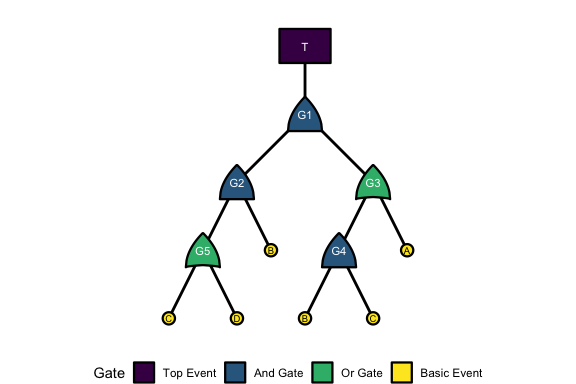

<!-- README.md is generated from README.Rmd. Please edit README.Rmd. -->

# tidyfault


## R Package for tidy *Fault Tree Analysis* (FTA)!

Uses `tidyverse`, `tidygraph`, and related tools to visualize fault
trees, identify minimal cutsets, and evaluate failure outcomes.

## Basic Usage

How do we use `tidyfault` to analyze fault trees?

### Load Packages and Data

Let’s start by loading our dependencies!

``` r
# Load dependencies
library(tidyfault)
library(tidyverse)
```

Next, let’s get some fake data to work with, including **nodes** and
**edges** in our fault tree.

``` r
#Load example data into our environment
data("fakenodes")
data("fakeedges")
```

### Workflow (Step-by-Step)

Finally, let’s demonstrate the basic workflow for `tidyfault`!

First, we…

1.  `curate()` a list of **gates** in the fault tree;

``` r
mygates = curate(nodes = fakenodes, edges = fakeedges)
mygates
#> # A tibble: 6 × 6
#>   gate  type  class     n set           items    
#>   <chr> <fct> <fct> <int> <chr>         <list>   
#> 1 T     top   top       1 " (G1) "      <chr [1]>
#> 2 G1    and   gate      2 " (G2 * G3) " <chr [2]>
#> 3 G2    and   gate      2 " (B * G5) "  <chr [2]>
#> 4 G3    or    gate      2 " (A + G4) "  <chr [2]>
#> 5 G4    and   gate      2 " (B * C) "   <chr [2]>
#> 6 G5    or    gate      2 " (C + D) "   <chr [2]>
```

2.  use `equate()` to find the boolean equation for the fault tree;

``` r
myequation = mygates %>% equate()
myequation
#> [1] " ( ( (B *  (C + D) )  *  (A +  (B * C) ) ) ) "
```

3.  `formulate()` that equation into an `R` function we can use;

``` r
myfunction = myequation %>% formulate()
myfunction
#> function (A, B, C, D) 
#> (((B * (C + D)) * (A + (B * C))))
#> <environment: 0x10e4e6240>
```

4.  `calculate()` the full truth table of all possible combinations of
    events and the `outcome` each leads to.

``` r
mycombos = myfunction %>% calculate()
head(mycombos)
#> # A tibble: 6 × 5
#>       A     B     C     D outcome
#>   <dbl> <dbl> <dbl> <dbl>   <dbl>
#> 1     0     1     1     0       1
#> 2     0     1     1     1       1
#> 3     1     1     0     1       1
#> 4     1     1     1     0       1
#> 5     1     1     1     1       1
#> 6     0     0     0     0       0
```

5.  `concentrate()` our gate structure into the minimum cutsets, the
    smallest sets of events necessary to cause system failure. This
    function uses boolean minimalization to find the minimum cutsets.

``` r
mymin = mygates %>% concentrate()
mymin
#> [1] "B*C"   "A*B*D"
```

6.  `tabulate()` the minimum cutsets and how much coverage they have
    over the total paths to failure found with `calculate()`.
    `tabulate()` needs both the minimum cutsets and the formula
    (function from step 3).

``` r
mytable = tabulate(mymin, formula = myfunction)
mytable
#> # A tibble: 2 × 4
#>   mincut cutsets failures coverage
#>   <chr>    <int>    <int>    <dbl>
#> 1 A*B*D        2        5      0.4
#> 2 B*C          4        5      0.8
```

7.  `illustrate()` + `plot()` to visualize the fault tree structure.

``` r
myviz = illustrate(nodes = fakenodes, edges = fakeedges, type = "both")
myplot = plot(myviz)
myplot
```



8.  `quantify()` to evaluate specific scenarios (binary) or top-event
    probabilities.

``` r
# Binary scenario evaluation
quantify(myfunction, c(TRUE, FALSE, TRUE, FALSE))
#> [1] FALSE

# Probabilistic evaluation
quantify(myfunction, c(0.10, 0.20, 0.05, 0.15), prob = TRUE)
#> [1] 0.01285
```

### Workflow (All at Once!)

Or, we can do this all in one fell swoop!

Let’s extract the minimum cutsets from our fault tree data!

``` r
# Build gates and formula once (needed for tabulate)
mygates = curate(nodes = fakenodes, edges = fakeedges)
myfunction = mygates %>%
  equate() %>%
  formulate()

# Run the full pipeline; tabulate() needs the formula for coverage stats
mytable = mygates %>%
  concentrate() %>%
  tabulate(formula = myfunction)
```

## Questions?

Contact: Timothy Fraser, PhD (<timothy.fraser.1@gmail.com>)
